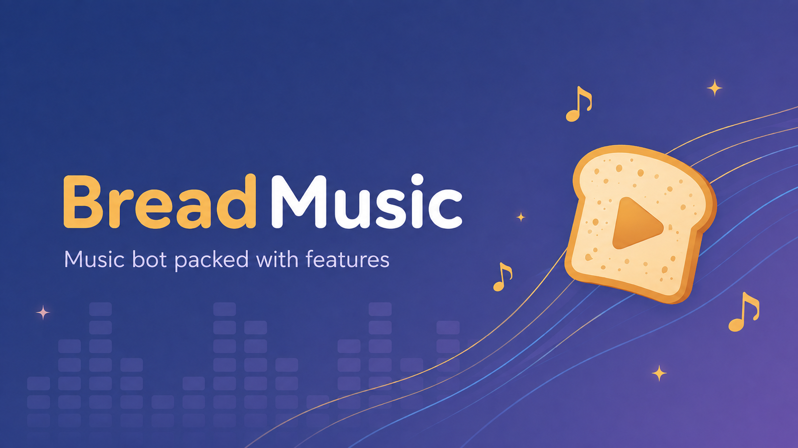

<div align="center">



Lavalink playback, smart autoplay, live dashboard, lyrics and persistent state.

`Discord.js` / `Lavalink` / `Next.js` / `Node.js`

</div>

---

## System Overview

```text
                         +-------------------+
                         |      Discord      |
                         +---------+---------+
                                   |
                          commands | events
                                   |
                         +---------v---------+
                         |     Bread Bot     |
                         |  Node.js API 3001 |
                         +----+---------+----+
                              |         |
                     playback|         |OAuth / SSE
                              |         |
                    +---------v--+   +--v---------------+
                    |  Lavalink  |   | Next.js Dashboard|
                    |    2333    |   |      3000        |
                    +------------+   +------------------+
```

| Component | Purpose |
| --- | --- |
| Bot | Discord commands, interactions and playback orchestration |
| Lavalink | Audio loading, streaming, filters and source plugins |
| API | OAuth, dashboard data, player actions and live SSE updates |
| Dashboard | Player, queue, history, lyrics, settings and remote control |
| SQLite + encrypted sessions | Guild configuration, queues, analytics, economy and OAuth sessions |

## Features

```text
[ playback ]  YouTube / Spotify / SoundCloud / Bandcamp
[ autoplay ]  prefetch / skip feedback / repetition avoidance
[ dashboard]  live player / queue drag-and-drop / uploads / controls
[ lyrics   ]  search / current track / synchronized live mode
[ history  ]  requester / source / autoplay marker / persistence
[ audio    ]  filters / seek / volume / loop / shuffle
[ state    ]  persistent queue / sessions / per-guild configuration
[ extras   ]  economy / blackjack / roulette / slots / RPS
```

### Autoplay

- Prefetches one candidate before the queue ends.
- Never jumps ahead of tracks manually added to the queue.
- Builds a rotating session profile from the last 40 manually requested tracks instead of replacing the seed after every request.
- Searches from up to three manual anchors per cycle and rewards candidates found through multiple anchors.
- Learns from skipped autoplay tracks during the current bot session.
- Avoids recent tracks, repeated artists and weak recommendations.
- Ignores local uploads as recommendation seeds.

### Lyrics

- `/lyrics` loads lyrics for the current track.
- `/lyrics query:artist - title` performs a manual search.
- Dashboard search supports artist and title fields.
- Live mode highlights and scrolls synchronized LRCLIB lines.
- Provider requests use retry, exponential backoff and request deduplication.
- Successful results are cached for 6 hours.

### History

- Stored separately for every Discord server.
- Includes track metadata, requester, source and autoplay state.
- Retained for 35 days with a limit of 40,000 events per guild.
- Survives bot and container restarts through `data/bread.sqlite`.

### Discord Activity

- Opens from a voice channel and joins that channel automatically.
- Shows the live player, queue, artwork, requester, seek position and volume.
- Provides a compact mini-player with queue, search and lyrics drawers.
- Searches while typing after a one-second pause; YouTube, Spotify, SoundCloud and other supported URLs can be pasted directly.
- Separates play-now from add-to-queue actions and supports local audio uploads.
- Includes synced lyrics, autoscroll and karaoke mode when synchronized lyrics are available.
- Respects the guild Dashboard Access and DJ role settings. Members without control access can still use the read-only view.

### Playback Feedback

- Playback failures are classified and reported with actionable messages.
- Voice channel status can show the current track and is configurable per guild.
- Local uploads are deduplicated and retained according to the upload store policy.

---

## Quick Start

### Requirements

```text
Node.js  22
Java     25
Discord  application + bot token
Spotify  developer credentials (optional)
```

### Install

```powershell
git clone <repository-url>
cd Bread

npm install
npm install --prefix web
Copy-Item .env.example .env
```

Configure `.env`, then register slash commands:

```powershell
npm run register
```

Start the development stack in three terminals:

```powershell
# Terminal 1
npm run dev:lavalink
```

```powershell
# Terminal 2
npm run dev:api
```

```powershell
# Terminal 3
npm run dev:web
```

```text
Dashboard  http://localhost:3000
API        http://localhost:3001
Lavalink   http://localhost:2333
```

> Slash commands are registered globally. Discord can take up to an hour to propagate
> global command changes. `DISCORD_GUILD_ID`, `COMMAND_GUILD_IDS` and
> `COMMAND_CLEANUP_GUILD_IDS` are only used to remove legacy guild-scoped commands.

Persistent bot state is stored in `data/bread.sqlite`. Existing `configs.json`,
`queues.json`, `analytics.json` and `economy.json` files are migrated automatically on
first startup and renamed with a `.migrated` suffix. OAuth sessions remain encrypted
and stored separately in `data/sessions`.

---

## Configuration

### Required

```ini
DISCORD_TOKEN=bot_token
DISCORD_CLIENT_ID=application_id
DISCORD_CLIENT_SECRET=oauth_client_secret

SESSION_SECRET=long_random_value
WEB_URL=http://localhost:3000
```

### Lavalink

```ini
LAVALINK_HOST=127.0.0.1
LAVALINK_PORT=2333
LAVALINK_PASSWORD=replace-with-a-long-random-password
LAVALINK_SECURE=false
```

### Spotify

```ini
SPOTIFY_CLIENT_ID=spotify_client_id
SPOTIFY_CLIENT_SECRET=spotify_client_secret
```

### Local upload storage

Audio uploads are limited to 256 MB per file and 1 GB for the shared
`data/uploads` directory by default. When the quota is reached, the oldest
uploads are removed first, except files currently used by a player or queue.
Persistent queues are protected as well, including while the bot is restarting.

```ini
UPLOAD_STORAGE_LIMIT_MB=1024
```

### Private guild access

Bread can remain publicly installable while refusing commands and dashboard access
outside an explicit server allowlist:

```ini
GUILD_ACCESS_MODE=allowlist
ALLOWED_GUILD_IDS=123456789012345678,987654321098765432
PRIVATE_ACCESS_CONTACT=aleksh8
```

Unauthorized servers keep the installed bot, but commands and interactions return a
private access notice. The bot also posts the notice once when it joins, does not
restore 24/7 playback there, and hides the server from the dashboard. An empty
allowlist denies every server. Use `GUILD_ACCESS_MODE=public` to disable the restriction.

The Discord OAuth redirect must exactly match:

```text
{WEB_URL}/api/auth/callback
```

See [`.env.example`](.env.example) for the complete configuration.

---

## Dashboard Access

Access is configured independently for every guild.

| Mode | Who can open the dashboard |
| --- | --- |
| `admin` | Members with Manage Server |
| `dj` | Admins and members recognized as DJs |
| `members` | Every member of the guild |

Default:

```text
dashboardAccess = admin
```

DJ recognition follows the same behavior as Discord player commands:

```text
DJ role configured     -> admin / moderator / member with DJ role
DJ role not configured -> every member is treated as a DJ
```

Administrative boundaries remain fixed:

| Capability | Member | DJ | Admin |
| --- | :---: | :---: | :---: |
| Status, history and lyrics | yes | yes | yes |
| Basic player controls | voice channel | yes | yes |
| Queue management and filters | no | yes | yes |
| Local audio uploads | no | yes | yes |
| Server settings | no | no | yes |
| Economy administration | no | no | yes |
| Remote Control / send as bot | no | no | yes |

If no DJ role is configured, users admitted through `dj` or `members` receive
the DJ player capabilities shown above.

Change access from Dashboard Settings or Discord:

```text
/config set dashboard_access
```

---

## Commands

### Playback

| Command | Action |
| --- | --- |
| `/play <query>` | Play or queue a track or playlist |
| `/pause` / `/resume` | Pause or resume playback |
| `/skip` / `/stop` | Skip or terminate playback |
| `/back` / `/replay` | Return to or replay a track |
| `/seek <time>` | Seek within the current track |
| `/volume` | Change player volume |
| `/loop` / `/shuffle` | Change queue behavior |
| `/autoplay` | Toggle automatic recommendations |

### Queue and audio

| Command | Action |
| --- | --- |
| `/queue` | Display the paginated queue |
| `/remove` / `/move` | Modify queue positions |
| `/skipto` | Jump to a queue position |
| `/clearqueue` | Remove upcoming tracks |
| `/filter` | Apply or reset audio filters |

### System

| Command | Action |
| --- | --- |
| `/lyrics [query]` | Current track or `artist - title` lyrics |
| `/dashboard` | Open the guild dashboard |
| `/config` | Read or modify guild configuration |
| `/help` | Show the complete command list |

Economy and game commands are documented by `/help` inside Discord.

Listening statistics are available through `/stats user` and `/stats server`.
User stats include top tracks and artists, source preference, active days and an
estimated requested duration. `/stats server detailed:true` adds source ranking,
requester ranking and retained activity patterns to the server overview.
When a DJ role is configured, listeners without that role can still use Skip: Bread
opens one shared vote in the player text channel, lists its voters and synchronizes
its progress and final result with the dashboard and Discord Activity.

---

## Docker

```text
+----------------------+-------+------------------------+
| Service              | Port  | Container              |
+----------------------+-------+------------------------+
| Lavalink             | 2333  | breadmusic-lavalink    |
| Bot API              | 3001  | breadmusic-bot         |
| Dashboard            | 3000  | breadmusic-web         |
+----------------------+-------+------------------------+
```

Create `.env` using `env.docker`, then build the stack:

```powershell
docker compose up -d --build
```

Production source is baked into the images. Updating the repository therefore
requires rebuilding the affected services.

Persistent mounts:

```text
./data                  -> bot state, sessions, queues and uploads
./lavalink/application.yml
./lavalink/plugins
```

---

## Verification

```powershell
# Backend tests
npm test

# Dashboard type check
.\web\node_modules\.bin\tsc.cmd --noEmit --project web\tsconfig.json

# Production dashboard build
npm run build --prefix web

# Compose validation
docker compose config
```

---

## Runtime Data

```text
data/
|-- bread.sqlite        configuration, queues, analytics and economy
|-- sessions/           OAuth sessions
`-- uploads/            temporary local audio
```

Never commit `data/`, `.env` or production secrets.

---

## Repository Layout

```text
Bread/
|-- src/
|   |-- bot.js                  Discord client and Lavalink events
|   |-- server.js               OAuth and dashboard API
|   |-- commands/               slash command definitions
|   |-- dashboard/              access and capability rules
|   |-- music/                  playback, autoplay, UI and lyrics
|   |-- state/                  SQLite-backed state stores
|   |-- games/                  economy and games
|   `-- utils/                  shared utilities
|-- web/
|   |-- app/                    Next.js routes
|   |-- components/             dashboard and landing components
|   `-- lib/                    API client and helpers
|-- lavalink/
|   |-- application.example.yml
|   `-- plugins/
|-- test/                       backend unit tests
|-- Dockerfile
`-- docker-compose.yml
```

---

## License

```text
GNU Affero General Public License v3.0 only
SPDX-License-Identifier: AGPL-3.0-only
Copyright (C) 2026 Aleks Szotek
```

Bread is free software distributed under the
[GNU Affero General Public License v3.0](LICENSE). If you modify Bread and make
that version available through a network, you must make the corresponding
source code available to users under the same license.

Third-party dependencies and bundled Lavalink plugins remain covered by their
respective licenses.

Source: [github.com/al3ksh/BreadMusic](https://github.com/al3ksh/BreadMusic)

---

<div align="center">

```text
audio in  ->  queue  ->  lavalink  ->  voice out
events in ->  state  ->  dashboard ->  control
```

</div>
