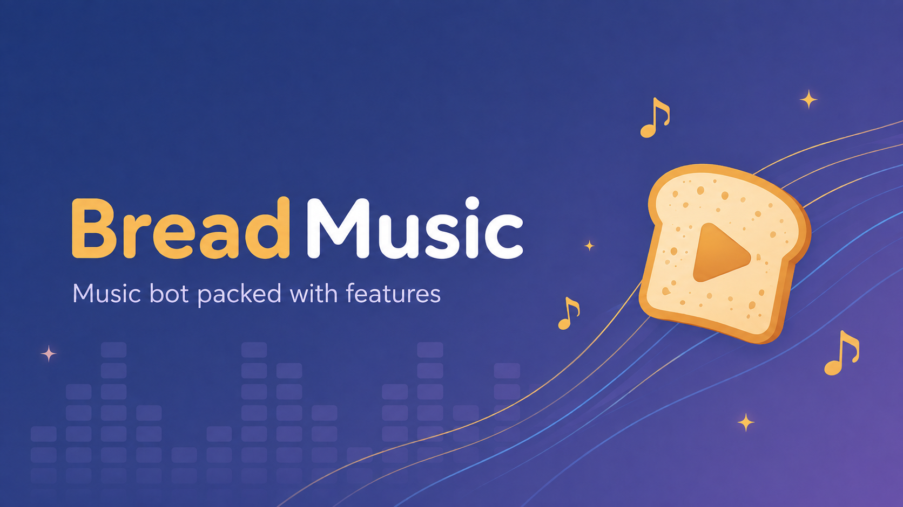
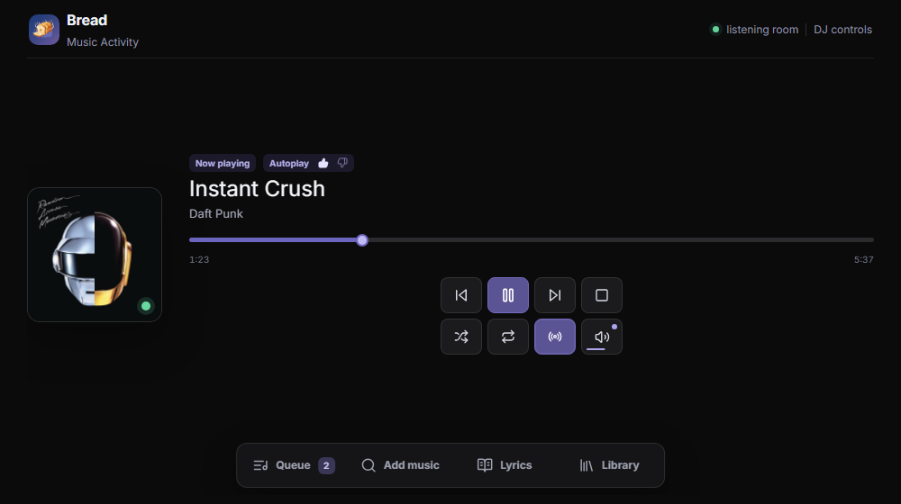
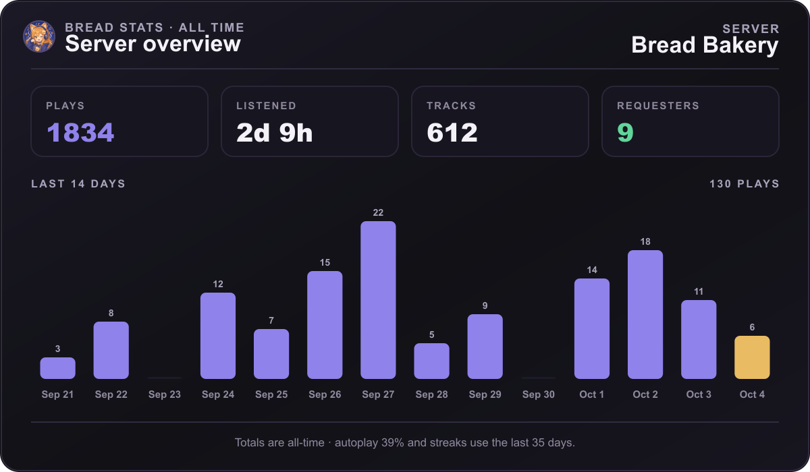
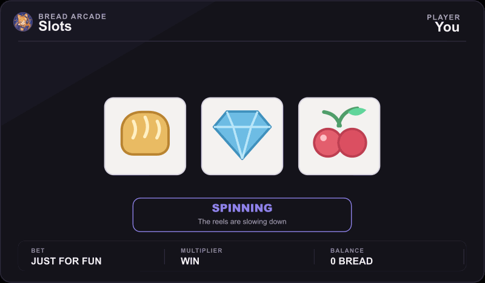
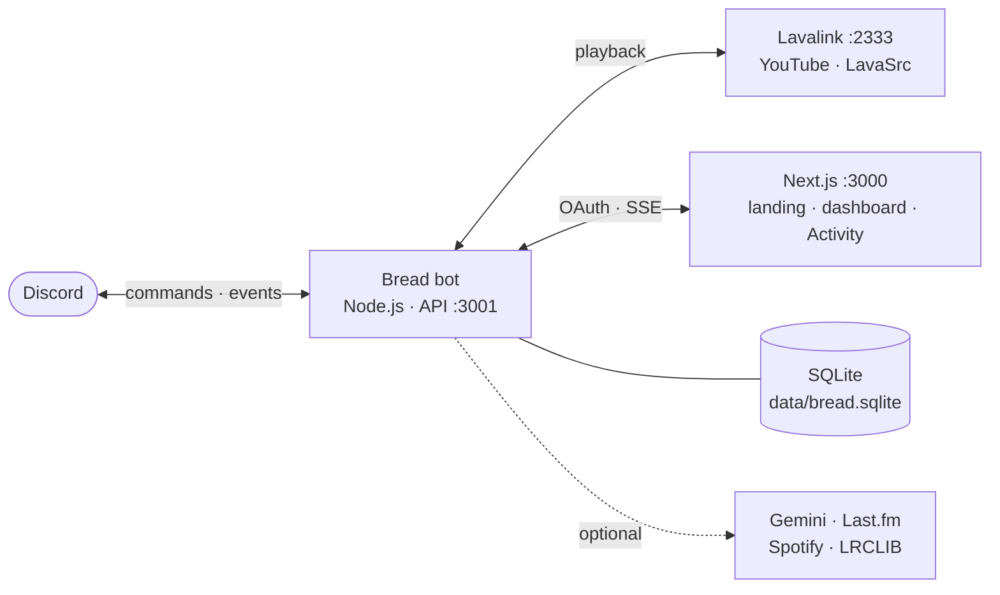

<div align="center">



### A self-hosted Discord music bot that plays together with the whole room.

Lavalink playback, autoplay that learns what your server likes, a Discord Activity,
a live dashboard, synced lyrics and an arcade, all from one stack you run yourself.

[](LICENSE)


**[Website](https://breadmusic.aleksh.xyz)** ·
**[Try it in the browser](https://breadmusic.aleksh.xyz/#playground)** ·
[Self-host](#quick-start) ·
[Commands](#commands) ·
[Configuration](#configuration)

</div>

---

## Why Bread

Most music bots give you a `/play` command and a queue. Bread treats the voice
channel as a shared listening room: everyone sees the same player, queue and
lyrics in Discord, in an Activity and on the web, and when the queue runs out
the bot keeps going with music that fits the people in the room.

<table>
<tr>
<td width="50%" valign="middle">

### 🎧 The Activity: a player inside the voice channel

Open Bread from the voice channel's Activity shelf and everyone gets the same live
player: artwork, seek bar, a shared queue you can drag into order, search,
uploads, a radio tuner, the sound panel and karaoke lyrics.

Permissions follow your server settings. Members without control still get the
read-only view and can start a vote skip.

</td>
<td width="50%">

</td>
</tr>
<tr>
<td width="50%">

</td>
<td width="50%" valign="middle">

### 📊 `/stats`: your server's listening history as a picture

One command renders a card for the server or for one member: plays and hours
listened, top tracks and artists, where songs came from, the busiest hours and
the arcade leaderboard. A menu under the image switches between the views.

</td>
</tr>
<tr>
<td width="50%" valign="middle">

### 🎰 The Arcade: something to do between songs

Slots, roulette, blackjack, rock-paper-scissors duels, dice and coin flips,
rendered as animated cards and paid in **BREAD**, the server's own currency
with hourly rewards and a leaderboard.

</td>
<td width="50%">

</td>
</tr>
</table>

### And everything around it

| | |
| --- | --- |
| ✨ **Autoplay that learns** | Likes, dislikes and skips shape what comes next. The next pick is ready before the queue ends, you can see it and reroll it, and recently played tracks stay out. |
| 📻 **Live radio** | `/radio` finds stations by name, genre or country, or plays a stream or Radio Garden link. Starred stations come first everywhere. |
| 🎚️ **Sound panel** | Presets like Bassboost and Nightcore, a 6-band EQ, speed and pitch. Save up to 15 of your own sounds. |
| 💜 **Your library** | Liked tracks and personal playlists: save the queue, import from Spotify, YouTube or SoundCloud, share them with a code. |
| 🎤 **Synced lyrics** | LRCLIB lyrics that follow the track, with autoscroll and a karaoke view in the Activity and dashboard. |
| 🖥️ **Web dashboard** | Live player and queue, history, uploads, server settings, DJ roles and the economy, updated over SSE. |
| 🛡️ **Shared control** | Dashboard access levels, a DJ role, vote skip that stays in sync across Discord, the Activity and the web. |
| 💾 **Survives restarts** | Queues, history, settings and taste profiles live in SQLite and come back after a redeploy. |

---

## How it fits together


```mermaid
flowchart LR
    D([Discord]) <-->|commands · events| B[Bread bot<br/>Node.js · API :3001]
    B <-->|playback| L[Lavalink :2333<br/>YouTube · LavaSrc]
    B <-->|OAuth · SSE| W[Next.js :3000<br/>landing · dashboard · Activity]
    B --- S[(SQLite<br/>data/bread.sqlite)]
    B -.->|optional| X[Gemini · Last.fm<br/>Spotify · LRCLIB]
```

| Component | What it does |
| --- | --- |
| **Bot** | Slash commands, buttons and menus, playback orchestration, autoplay |
| **API** | OAuth, dashboard and Activity data, player actions, live SSE updates |
| **Lavalink** | Audio loading and streaming, filters, YouTube and Spotify source plugins |
| **Web** | Public landing with a silent demo, the dashboard and the Discord Activity |
| **SQLite + sessions** | Guild config, queues, history, library, economy and encrypted OAuth sessions |

---

## Quick start

You need Node.js 22, Java 25 (for Lavalink), a Discord application with a bot
token and, optionally, Spotify developer credentials.

### With Docker (recommended)

```bash
git clone https://github.com/al3ksh/BreadMusic.git
cd BreadMusic
cp env.docker .env                                         # fill in, see Configuration
cp lavalink/application.example.yml lavalink/application.yml
docker compose up -d --build
docker compose exec bot npm run register
```

| Service | Port | Container |
| --- | --- | --- |
| Lavalink | 2333 | `breadmusic-lavalink` |
| Bot API | 3001 | `breadmusic-bot` |
| Web | 3000 | `breadmusic-web` |

Source code is baked into the images, so after pulling changes rebuild the
services that changed. Compose mounts `./data`, `./lavalink/application.yml`
and `./lavalink/plugins`, and applies bounded CPU and memory limits that can be
overridden with the `LAVALINK_*_LIMIT`, `BOT_*_LIMIT` and `WEB_*_LIMIT` variables.

<details>
<summary><b>Local development without Docker</b></summary>

```powershell
npm install
npm install --prefix web
Copy-Item .env.example .env
npm run register
```

Then start the stack in three terminals:

```powershell
npm run dev:lavalink   # Lavalink  http://localhost:2333
npm run dev:api        # Bot + API http://localhost:3001
npm run dev:web        # Web       http://localhost:3000
```

Slash commands are registered globally and Discord can take up to an hour to
propagate changes. `DISCORD_GUILD_ID`, `COMMAND_GUILD_IDS` and
`COMMAND_CLEANUP_GUILD_IDS` are only used to remove legacy guild-scoped commands.

</details>

---

## Configuration

The minimum `.env`:

```ini
DISCORD_TOKEN=bot_token
DISCORD_CLIENT_ID=application_id
DISCORD_CLIENT_SECRET=oauth_client_secret
SESSION_SECRET=long_random_value
WEB_URL=http://localhost:3000

LAVALINK_HOST=127.0.0.1
LAVALINK_PORT=2333
LAVALINK_PASSWORD=replace-with-a-long-random-password
LAVALINK_SECURE=false
```

The Discord OAuth redirect must be exactly `{WEB_URL}/api/auth/callback`. In
production, `WEB_URL` is the public HTTPS origin; it is passed to both the bot and
the web container. [`.env.example`](.env.example) lists every option.

<details>
<summary><b>Spotify, Gemini and Last.fm</b></summary>

```ini
SPOTIFY_CLIENT_ID=spotify_client_id
SPOTIFY_CLIENT_SECRET=spotify_client_secret

# Optional AI discovery and ranking for autoplay (key from Google AI Studio)
GEMINI_AUTOPLAY_ENABLED=true
GEMINI_API_KEY=
GEMINI_AUTOPLAY_MODEL=gemini-3.5-flash-lite

# Optional similar-tracks source for autoplay
LASTFM_API_KEY=
```

Without these keys autoplay still works on its own local algorithm. Only music
metadata is sent to Gemini and Last.fm, never Discord IDs or usernames.

</details>

<details>
<summary><b>Autoplay in detail</b></summary>

- The next pick is prepared before the queue ends, so skipping an autoplay track
  starts the next one right away. It never jumps ahead of tracks people queued.
- Candidates come from several sources at once: YouTube Radio mixes, Last.fm
  similar tracks, searches seeded from recent manual requests and, when enabled,
  Gemini discovery. A local scorer ranks them, optionally re-ranked by Gemini.
- Each server keeps a taste profile in SQLite. 👍 and 👎, quick skips and recent
  plays all count, and the profile survives restarts.
- Tracks played in the server in the last three days are skipped, as are
  disliked tracks (`/autoplay disliked` lists them) and too many songs by the same artist.
- The up-next pick is shown in Discord, the dashboard and the Activity and can be
  rerolled with `/autoplay next`. When nothing fits, Bread says so instead of
  going quiet.
- Local uploads are never used as recommendation seeds.

</details>

<details>
<summary><b>Local uploads and artwork</b></summary>

Uploads are limited to 256 MB per file and 1 GB for `data/uploads` by default.
When the quota is reached the oldest uploads go first, except files used by a
player, a queue or a persistent queue being restored. Playback and cover URLs are
HMAC-signed, expire after 24 hours and are renewed in live snapshots and restored
queues.

```ini
UPLOAD_STORAGE_LIMIT_MB=1024
UPLOAD_SIGNING_SECRET=long_random_value
```

Embedded cover art (ID3/APIC, FLAC pictures, M4A tags) is extracted locally in a
single sandboxed subprocess with a four-second deadline, then stored as a
metadata-free JPEG of at most 512 × 512 pixels next to the upload. Failed or slow
extractions never block playback. Discord embeds need `WEB_URL` to be the public
HTTPS origin with `/api/uploads` routed to the bot.

</details>

<details>
<summary><b>Private guild access</b></summary>

Bread can stay publicly installable while only serving an allowlist of servers:

```ini
GUILD_ACCESS_MODE=allowlist
ALLOWED_GUILD_IDS=123456789012345678,987654321098765432
PRIVATE_ACCESS_CONTACT=your_discord_name
```

Other servers keep the installed bot, but commands reply with a private-access
notice, 24/7 playback is not restored there and the dashboard hides them. An
empty allowlist denies every server; `GUILD_ACCESS_MODE=public` lifts the restriction.

</details>

<details>
<summary><b>Arcade rendering, stats time zone and health checks</b></summary>

- `ARCADE_ANIMATION_WORKERS` (`1`-`4`, default `2`) sizes the GIF worker pool.
  Use `1`-`2` on a Raspberry Pi. Requests above the limit get a static PNG instead
  of waiting.
- `STATS_TIME_ZONE` (an IANA zone such as `Europe/Warsaw`, default `UTC`) sets the
  hours shown in `/stats`.
- `GET /api/healthz` returns `200` only when Discord is ready and a Lavalink node is
  connected, otherwise `503`, without exposing guild or user data.
- The landing demo uses a sample catalogue by default. Live demo search runs on an
  isolated worker; see [landing release and rollback](docs/landing-release.md).

</details>

---

## Who can do what

Each server picks who can open the dashboard: `admin` (Manage Server, the
default), `dj` or `members`. Change it from the dashboard settings or with
`/config set dashboard_access`.

| Capability | Member | DJ | Admin |
| --- | :---: | :---: | :---: |
| Status, history and lyrics | ✅ | ✅ | ✅ |
| Basic player controls | in voice | ✅ | ✅ |
| Queue management and sound | | ✅ | ✅ |
| Local audio uploads | | ✅ | ✅ |
| Server settings | | | ✅ |
| Economy administration | | | ✅ |
| Remote control / send as bot | | | ✅ |

When a DJ role is set, only admins, moderators and members with that role are
DJs. Everyone else can still skip by vote: Bread opens one shared vote, lists the
voters and keeps it in sync with the dashboard and the Activity. With no DJ role,
every member counts as a DJ.

---

## Commands

| Playback | |
| --- | --- |
| `/play <query>` | Play or queue a track, playlist or link |
| `/radio <station>` | Live radio by name, genre or country, or a stream / Radio Garden link |
| `/pause` · `/resume` · `/skip` · `/stop` | The usual |
| `/back` · `/replay` · `/seek` · `/volume` | Go back, replay, jump, set the level |
| `/loop` · `/shuffle` | Change how the queue plays |
| `/autoplay` | Toggle it, `like`, `dislike`, `next` to reroll, `disliked` to review |

| Queue, sound and library | |
| --- | --- |
| `/queue` · `/remove` · `/move` · `/skipto` · `/clearqueue` | Manage what's coming up |
| `/sound` | Presets, 6-band EQ, speed and pitch; `Save as…` keeps your own |
| `/history` | Recently played, ready to queue again |
| `/liked` · `/playlist` | Your liked tracks and playlists: play, save, add, import, share |

| Everything else | |
| --- | --- |
| `/lyrics [query]` | Lyrics for the current track or `artist - title` |
| `/stats` | Overview, top, sources, rhythm and arcade views as an image |
| `/slots` · `/roulette` · `/blackjack` · `/rps` · `/dice` · `/coinflip` | The Arcade |
| `/balance` · `/hourly` · `/leaderboard` | BREAD economy |
| `/dashboard` · `/config` · `/help` | Open the dashboard, change settings, list every command |

---

## Development

```powershell
npm test                                    # bot unit tests
npm run test:landing --prefix web           # landing demo tests
npx tsc --noEmit -p web                     # web type check
node web/preview/bot-contract.cjs --check   # demo matches the real bot embeds
npm run build --prefix web                  # production web build
docker compose config                       # compose validation
```

<details>
<summary><b>Repository layout and runtime data</b></summary>

```text
src/
  bot.js           Discord client and Lavalink events
  server.js        OAuth, dashboard and Activity API
  commands/        slash commands, grouped by domain
  dashboard/       access and capability rules
  music/           playback, autoplay, radio, sound, lyrics, embeds
  stats/           /stats views and image rendering
  games/           arcade and economy
  state/           SQLite-backed stores
  utils/           shared helpers
web/
  app/             Next.js routes: landing, dashboard, Activity
  components/      dashboard, Activity and landing components
  lib/             API client and helpers
lavalink/          Lavalink config example and plugins
test/              bot unit tests

data/              (created at runtime, never commit it)
  bread.sqlite     config, queues, history, library, economy
  sessions/        encrypted OAuth sessions
  uploads/         local audio and covers
```

Older `configs.json`, `queues.json`, `analytics.json` and `economy.json` files are
migrated into SQLite on first start and renamed with a `.migrated` suffix.

</details>

---

## License

Bread is free software under the [GNU Affero General Public License v3.0](LICENSE)
(`AGPL-3.0-only`), © 2026 Aleks Szotek. If you run a modified version for others
over a network, you must offer them its source under the same license.
Third-party dependencies and the bundled Lavalink plugins keep their own licenses.

<div align="center">

<sub>audio in → queue → lavalink → voice out · events in → state → dashboard → control</sub>

</div>
